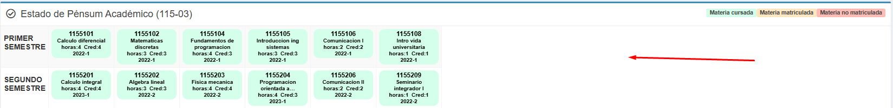
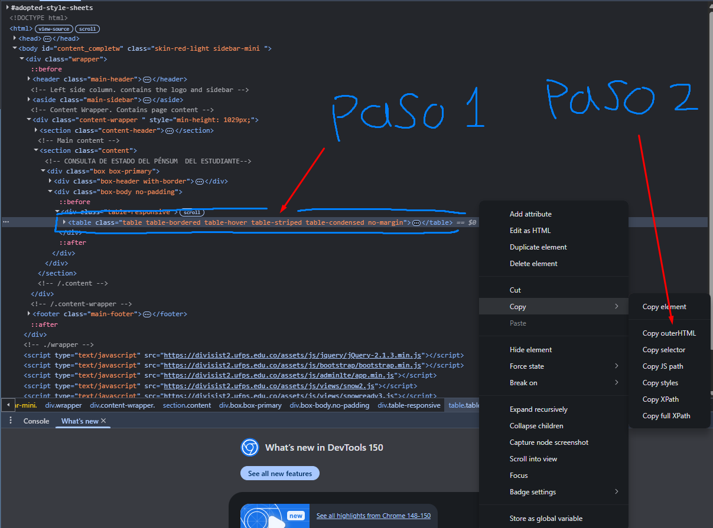

# APC — Asistente de Planeación Curricular

Arma tu plan de estudios semestre a semestre a partir de las materias que ya
viste, respetando prerrequisitos y créditos mínimos. En vez de cuadrar el
pénsum a mano, marcas lo que llevas aprobado y la app distribuye lo que falta.

Plan curricular: Ingeniería de Sistemas, 10 semestres.

## Requisitos

- Python 3.10 o superior

## Instalación

```bash
pip install -r requirements.txt
python main.py
```

## Primeros pasos

1. **Crea tu perfil** — botón **Nuevo Perfil** en la pantalla inicial. Cada
   perfil guarda tus materias vistas y las materias que asignes manualmente a
   un semestre.
2. **Importa tu pénsum** — dentro del plan, botón **Importar Pénsum**. Es la
   forma rápida de marcar todo lo aprobado de una sola vez; ver
   [Importar tu pénsum](#importar-tu-pénsum).
3. **Revisa el plan generado** — la app reparte las materias pendientes en los
   semestres que vienen. Puedes ajustar a mano lo que quieras desde
   **Editar Materias**.

## Importar tu pénsum

En lugar de marcar 50 materias una por una, pegas el pénsum del portal y la app
lo lee por ti.

### 1. Copia el HTML del portal

1. Inicia sesión en divisist, luego ve al apartado **"Información académica"** → **"Pensum"**.
2. En cualquier espacio en blanco dentro del recuadro de las materias, haz clic
   derecho y en el menú desplegable que aparece, presiona **"Inspeccionar"**.

   

3. Se abre el panel de desarrollador del navegador con el código HTML de la
   página. Busca la etiqueta `<table>`, haz clic derecho sobre esa línea de
   código y en el menú que aparece, elige → **Copy** → **Copy outerHTML**.

   

4. Vuelve a la app, abre **Importar Pénsum** en el perfil donde quieras importar
   el pénsum y pega el contenido.

> Asegúrate de seleccionar la etiqueta `<table>`. Si copiaste de menos, al
> analizar sale *"No se encontró ninguna materia"*.

### 2. Pulsa Analizar

Todavía no se guarda nada. La app lee el HTML y te muestra un resumen de lo que
pasaría si aplicaras: cuántas materias encontró, cuántas están aprobadas y
cuántas quedarían marcadas como vistas.

### 3. Revisa el resumen

Tres cosas que vale la pena mirar antes de aplicar:

- **Electivas.** El portal usa códigos reales (`1155513`, `1157004`…) mientras
  que la app las modela como cupos genéricos (Sociohumanística I, Electiva
  Profesional III…). Cada electiva aprobada se asigna a un cupo con el mismo
  número de créditos, de la más antigua a la más reciente. El resumen lista el
  mapeo `nombre real → cupo`; revísalo por si alguna quedó en un cupo que no
  esperabas.
- **Avisos.** Materias aprobadas que no existen en el plan de la app, o
  electivas para las que ya no quedan cupos libres. Se ignoran, pero se listan
  para que sepas qué no entró.

Si algo no cuadra, **Volver a pegar** te devuelve al paso 1 sin cerrar la
ventana.

### 4. Pulsa Aplicar al perfil

Se guarda el perfil y el plan se regenera con las materias que te faltan.

## Uso avanzado: extraer el pénsum por consola

El mismo lector está disponible como script, por si quieres el pénsum en JSON
sin abrir la app:

```bash
python tools/scrape_pensum.py data/pensum.html -o data/pensum.json
```

Guarda en `data/pensum.html` el HTML que copiaste del portal y pásalo como
argumento. El JSON de salida contiene `materias` y `electivas`; el resumen de la
corrida y los avisos salen por la salida de error.
